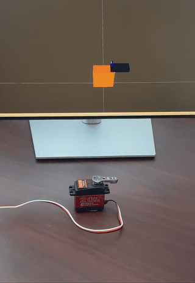

# PCA9685 Hardware Interface

### `ros2_control` Parameters

| Parameter         | Required | Type | Description                                          |
|-------------------|----------|------|------------------------------------------------------|
| `i2c_device`       | false | string  | I2C bus to use e.g. "/dev/i2c-1"                    |
| `i2c_address`      | false | int     | I2C address of the PCA9685 to control               |
| `pwm_frequency`    | false | double  | PWM frequency                                       |
| `joint/channel`    | true  | integer | Driver channel to output on [0-15]                  |
| `joint/pwm_low`    | false | double  | Pulse width (ms) of minimum angle / speed           |
| `joint/pwm_high`   | false | double  | Pulse width (ms) of maximum angle / speed           |
| `joint/pwm_zero`   | false | double  | Pulse width (ms) of zero angle / speed              |
| `joint/scale`      | false | double  | Real-world angle (rad) or speed (rad/s) at pwm_high |


### Tips

The `pwm_test` executable can be used to determine PWM limits: `ros2 run pca9685_hardware_interface pwm_test --ros-args -p channel:=0`

For position servos, zero is set in the middle of the reachable range to follow MoveIt's convention.
After finding the zero point and hard limits, tune the scale and limits until 90-degree angles are correct.

If a state interface is specified, it must match the command interface type. The reported state is simply the last command with limits applied.

This hardware interface does not define command interfaces for other PWM devices such as LEDs. However, they can be driven by a position or velocity interface.
Set `pwm_low` and `pwm_zero` to zero, and set `pwm_high` to 1000/`pwm_frequency`. Then a command in the range of [0.0, 1.0] will map to [0, 100]% duty cycle.


# pca9685_ros2_control_demo

### `diff_drive_controller`


```
ros2 launch pca9685_ros2_control_example diff_drive.launch.py
```
```
ros2 run teleop_twist_keyboard teleop_twist_keyboard --ros-args -p stamped:=true -r /cmd_vel:=/diffbot_base_controller/cmd_vel
```


### `forward_command_controller`



```
ros2 launch pca9685_ros2_control_example position_servo.launch.py
```
```
ros2 topic pub /forward_position_controller/commands std_msgs/msg/Float64MultiArray "{layout:{dim: [], data_offset: 0}, data: [-1.57]}" -1
```
